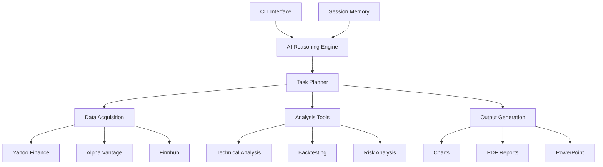

# 🤖 AI Investment Research Assistant

[](https://python.org)
[](LICENSE)
[](https://github.com/marcoakes/ai-investment-advisor)
[](https://github.com/marcoakes/ai-investment-advisor/actions)
[](https://github.com/marcoakes/ai-investment-advisor/actions)

[](https://gitpod.io/#https://github.com/marcoakes/ai-investment-advisor)
[](https://colab.research.google.com/github/marcoakes/ai-investment-advisor/blob/main/AI_Investment_Assistant_Demo.ipynb)
[](https://mybinder.org/v2/gh/marcoakes/ai-investment-advisor/main)
[](https://replit.com/new/github/marcoakes/ai-investment-advisor)

[](https://github.com/marcoakes/ai-investment-advisor/issues)
[](https://github.com/marcoakes/ai-investment-advisor/pulls)
[](https://github.com/marcoakes/ai-investment-advisor/commits/main)
[](https://hub.docker.com/r/marcoakes/ai-investment-advisor)

> **🚀 A sophisticated AI-powered investment research assistant with natural language CLI interface**

Transform your investment analysis with an intelligent assistant that combines multiple financial data sources, advanced technical analysis, strategy backtesting, and automated reporting - all through simple conversational commands.

---

## 📸 **Screenshots & Demo**

```bash
💬 Ask me anything about investments: analyze AAPL stock

🧠 Understanding your query...
   Query type: stock_analysis
   Symbols found: AAPL

📋 Planned 4 task(s):
   1. stock_aggregator (data_acquisition)
   2. technical_analyzer (analysis)  
   3. trading_signals (analysis)
   4. chart_generator (visualization)

⚙️ Executing analysis...
✅ Analysis completed successfully!

📈 STOCK ANALYSIS SUMMARY

🏢 AAPL:
   Company: Apple Inc.
   Sector: Technology
   Current Price: $184.92
   📊 Technical indicators calculated
   📡 Trading signals generated

📊 Charts created: 1 file(s)
   • technical_chart_20241207_143022.png
```

---

## ✨ **Key Features**

### 🎯 **Core Capabilities**
- **🗣️ Natural Language Interface** - Ask questions in plain English
- **📊 Multi-Source Data Integration** - Yahoo Finance, Alpha Vantage, Finnhub APIs  
- **🔍 Advanced Technical Analysis** - RSI, MACD, Bollinger Bands, Moving Averages
- **📈 Strategy Backtesting** - Test strategies with comprehensive performance metrics
- **⚖️ Comparative Analysis** - Side-by-side stock comparisons
- **📊 Professional Visualizations** - Publication-ready charts and graphs
- **📄 Automated Reports** - PDF documents and PowerPoint presentations
- **🧠 AI Task Planning** - Intelligent multi-step analysis execution
- **💾 Session Memory** - Context retention across conversations

### 🛠️ **Supported Analysis Types**
| Analysis Type | Description | Example Query |
|---------------|-------------|---------------|
| **Stock Analysis** | Comprehensive fundamental & technical analysis | `"analyze TSLA"` |
| **Technical Analysis** | In-depth technical indicators and signals | `"technical analysis for AAPL"` |
| **Strategy Backtesting** | Historical strategy performance testing | `"backtest strategy for MSFT"` |
| **Comparative Analysis** | Multi-stock performance comparison | `"compare AAPL vs GOOGL"` |
| **Risk Assessment** | VaR, Sharpe ratio, drawdown analysis | `"risk analysis for my portfolio"` |
| **Market Research** | News sentiment and fundamental data | `"research semiconductor stocks"` |

---

## 🚀 **Quick Start**

### **🌐 Try Online (No Installation Required)**

| Platform | Description | Launch |
|----------|-------------|--------|
| **🔗 Gitpod** | Full development environment in browser | [](https://gitpod.io/#https://github.com/marcoakes/ai-investment-advisor) |
| **📓 Google Colab** | Interactive notebook with demos | [](https://colab.research.google.com/github/marcoakes/ai-investment-advisor/blob/main/AI_Investment_Assistant_Demo.ipynb) |
| **🚀 Binder** | Jupyter environment in browser | [](https://mybinder.org/v2/gh/marcoakes/ai-investment-advisor/main) |
| **⚡ Replit** | Code and run instantly | [](https://replit.com/new/github/marcoakes/ai-investment-advisor) |

### **💻 Local Installation**
```bash
# Clone the repository
git clone https://github.com/marcoakes/ai-investment-advisor.git
cd ai-investment-advisor

# Install dependencies
pip install -r requirements.txt

# Run the application
python investment_advisor/cli.py
```

### **🐳 Docker Installation**
```bash
# Run with Docker
docker run -it --rm ghcr.io/marcoakes/ai-investment-advisor:latest

# Or build locally
docker build -t ai-investment-advisor .
docker run -it ai-investment-advisor
```

### **First Analysis**
```bash
# Interactive mode
python investment_advisor/cli.py

💬 Ask me anything about investments: analyze Apple stock
```

### **Single Query Mode**
```bash
python investment_advisor/cli.py --query "compare TSLA vs F"
```

---

## 💡 **Usage Examples**

### **📊 Stock Analysis**
```bash
"Analyze AAPL stock"
"Tell me about Tesla" 
"Research Microsoft fundamentals"
```

### **⚖️ Comparative Analysis** 
```bash
"Compare AAPL vs MSFT"
"Tesla versus Ford analysis"
"Which is better: GOOGL or META?"
```

### **📈 Technical Analysis**
```bash
"Show technical indicators for NVDA"
"Generate trading signals for AMZN"
"RSI and MACD analysis for SPY"
```

### **🔄 Strategy Backtesting**
```bash
"Backtest moving average strategy for AAPL"
"Test RSI strategy on Bitcoin"
"Historical performance of momentum strategy"
```

### **📊 Visualization & Reporting**
```bash
"Create charts for my analysis"
"Generate a PDF report"  
"Make a PowerPoint presentation"
"Plot price history with indicators"
```

---

## 🏗️ **Architecture Overview**



### **🧩 Module Structure**
```
investment_advisor/
├── 🎯 cli.py                    # Main CLI interface
├── 🧠 core/                     # Core framework  
│   ├── base.py                  # Tool registry & base classes
│   ├── session.py               # Memory & context management
│   └── reasoning.py             # AI task planning & execution
├── 📊 data/                     # Data acquisition
│   └── stock_data.py            # Financial APIs integration
├── 🔬 analysis/                 # Analysis engines
│   ├── technical.py             # Technical indicators & signals
│   └── backtesting.py           # Strategy testing & comparison
└── 📈 output/                   # Report generation
    ├── charts.py                # Visualization engine
    └── reports.py               # PDF & PowerPoint generation
```

---

## 📋 **Available Commands**

### **🔍 Analysis Commands**
| Command | Description | Example |
|---------|-------------|---------|
| `analyze <SYMBOL>` | Comprehensive stock analysis | `analyze AAPL` |
| `technical <SYMBOL>` | Technical analysis focus | `technical TSLA` |
| `compare <SYM1> <SYM2>` | Compare two stocks | `compare MSFT GOOGL` |
| `backtest <SYMBOL>` | Strategy backtesting | `backtest AMZN` |

### **📊 Visualization Commands**
| Command | Description | Example |
|---------|-------------|---------|
| `chart <SYMBOL>` | Generate stock charts | `chart NVDA` |
| `plot <SYMBOL>` | Price visualizations | `plot SPY` |

### **📄 Reporting Commands**  
| Command | Description | Example |
|---------|-------------|---------|
| `report` | Generate PDF report | `report` |
| `presentation` | Create PowerPoint | `presentation` |

### **⚙️ Utility Commands**
| Command | Description |
|---------|-------------|
| `status` | Session information |
| `history` | Analysis history |
| `tools` | Available tools list |
| `clear` | Clear session memory |
| `help` | Show help message |
| `quit` | Exit application |

---

## 📊 **Technical Indicators**

### **📈 Trend Indicators**
- **Simple Moving Average (SMA)** - 20, 50, 200 period
- **Exponential Moving Average (EMA)** - 12, 26 period
- **MACD** - Moving Average Convergence Divergence
- **Bollinger Bands** - Volatility bands

### **🔄 Momentum Indicators**  
- **RSI** - Relative Strength Index
- **Stochastic Oscillator** - %K and %D lines
- **Williams %R** - Momentum oscillator

### **📊 Volume Indicators**
- **Volume SMA** - Volume moving averages
- **On-Balance Volume (OBV)** - Volume-price trend
- **Volume Rate of Change** - Volume momentum

### **🎯 Trading Signals**
- **Moving Average Crossovers** - Golden/Death cross
- **RSI Overbought/Oversold** - Entry/exit signals  
- **MACD Signal Line Crossovers** - Trend changes
- **Bollinger Band Squeezes** - Volatility breakouts

---

## 📈 **Performance Metrics**

### **📊 Backtesting Metrics**
| Metric | Description |
|--------|-------------|
| **Total Return** | Overall strategy performance |
| **Annualized Return** | Yearly performance average |
| **Sharpe Ratio** | Risk-adjusted returns |
| **Maximum Drawdown** | Largest peak-to-trough decline |
| **Win Rate** | Percentage of profitable trades |
| **Volatility** | Standard deviation of returns |

### **🔍 Risk Metrics**
| Metric | Description |
|--------|-------------|
| **Value at Risk (VaR)** | Potential loss at confidence level |
| **Conditional VaR** | Expected loss beyond VaR |
| **Beta** | Market correlation coefficient |
| **Alpha** | Excess return vs benchmark |
| **Information Ratio** | Active return vs tracking error |

---

## 🔧 **Configuration**

### **🔑 API Keys (Optional)**
Enhance data access with professional APIs:

```bash
# Alpha Vantage (Free tier: 5 calls/min, 500 calls/day)
export ALPHA_VANTAGE_API_KEY="your_api_key_here"

# Finnhub (Free tier: 60 calls/min)  
export FINNHUB_API_KEY="your_api_key_here"
```

**Get API Keys:**
- [Alpha Vantage](https://www.alphavantage.co/support/#api-key) - Financial data
- [Finnhub](https://finnhub.io/register) - Market data & news

### **⚙️ Customization**
Edit `config.py` to customize:
- Output directories
- Chart styling  
- Analysis periods
- Technical indicator parameters
- Report formatting

---

## 🐳 **Docker Deployment**

### **Quick Start with Docker**
```bash
# Build and run
docker build -t ai-investment-advisor .
docker run -it ai-investment-advisor

# With Docker Compose
docker-compose up
```

### **Docker Hub**
```bash
# Pull from Docker Hub (when available)
docker pull marcoakes/ai-investment-advisor:latest
docker run -it marcoakes/ai-investment-advisor:latest
```

---

## 🌐 **Web Interface (Optional)**

Launch the web interface for browser-based access:

```bash
# Install Streamlit
pip install streamlit

# Run web app
streamlit run web_app.py
```

Access at: `http://localhost:8501`

---

## 📁 **Output Files**

The application generates:

### **📊 Charts** (`charts/`)
- `technical_chart_YYYYMMDD_HHMMSS.png` - Technical analysis charts
- `price_chart_YYYYMMDD_HHMMSS.png` - Price history charts  
- `performance_chart_YYYYMMDD_HHMMSS.png` - Backtesting results
- `comparison_chart_YYYYMMDD_HHMMSS.png` - Multi-stock comparisons

### **📄 Reports** (`reports/`)
- `investment_report_YYYYMMDD_HHMMSS.pdf` - Comprehensive analysis reports

### **📊 Presentations** (`presentations/`)
- `investment_presentation_YYYYMMDD_HHMMSS.pptx` - PowerPoint slide decks

---

## 🔧 **Requirements**

### **System Requirements**
- **Python:** 3.8 or higher
- **Memory:** 4GB RAM recommended
- **Storage:** 1GB free space
- **Network:** Internet connection for data APIs

### **Python Dependencies**
```
pandas>=2.0.0          # Data manipulation
numpy>=1.24.0          # Numerical computing  
matplotlib>=3.7.0      # Plotting
seaborn>=0.12.0        # Statistical visualization
yfinance>=0.2.20       # Yahoo Finance API
reportlab>=4.0.0       # PDF generation
python-pptx>=0.6.21    # PowerPoint generation
requests>=2.31.0       # HTTP client
scipy>=1.10.0          # Scientific computing
```

---

## 🤝 **Contributing**

We welcome contributions! Here's how to get started:

### **🐛 Bug Reports**
- Use GitHub Issues
- Include system info and error logs
- Provide steps to reproduce

### **💡 Feature Requests** 
- Describe the feature and use case
- Check existing issues first
- Consider implementation complexity

### **🔀 Pull Requests**
1. Fork the repository
2. Create feature branch: `git checkout -b feature-name`
3. Make changes with tests
4. Submit pull request

### **Development Setup**
```bash
# Clone for development
git clone https://github.com/marcoakes/ai-investment-advisor.git
cd ai-investment-advisor

# Install development dependencies
pip install -e .
pip install pytest black flake8

# Run tests
pytest

# Format code
black investment_advisor/
```

---

## 🐛 **Troubleshooting**

### **Common Issues**

#### **Import Errors**
```bash
# Reinstall dependencies
pip install -r requirements.txt --upgrade

# Check Python version
python --version  # Should be 3.8+
```

#### **API Rate Limits**  
- **Yahoo Finance:** Built-in rate limiting, retries automatically
- **Alpha Vantage:** 5 calls/min free tier - upgrade for more
- **Finnhub:** 60 calls/min free tier

#### **Memory Issues**
```bash
# Clear session memory
clear

# Restart application
quit
python investment_advisor/cli.py
```

#### **Chart Generation Errors**
```bash
# Install system dependencies (Linux)
sudo apt-get install python3-dev python3-tk

# macOS  
brew install python-tk

# Windows: Usually included with Python
```

#### **PDF Generation Issues**
```bash
# Install additional fonts (Linux)
sudo apt-get install fonts-liberation

# Check permissions
ls -la reports/
```

### **Getting Help**
- 📖 Check documentation first
- 🐛 Search existing GitHub Issues  
- ❓ Ask questions in Discussions
- 📧 Contact maintainers for critical issues

---

## 📜 **License**

This project is licensed under the **MIT License** - see the [LICENSE](LICENSE) file for details.

### **Disclaimer**
⚠️ **Important:** This software is for educational and research purposes only. Always conduct your own due diligence and consult with financial professionals before making investment decisions. Past performance does not guarantee future results.

---

## 🌟 **Star History**

[](https://star-history.com/#marcoakes/ai-investment-advisor&Timeline)

---

## 📞 **Support & Community**

- 🐛 **Issues:** [GitHub Issues](https://github.com/marcoakes/ai-investment-advisor/issues)
- 💬 **Discussions:** [GitHub Discussions](https://github.com/marcoakes/ai-investment-advisor/discussions)  
- 📧 **Email:** your.email@example.com
- 🐦 **Twitter:** [@marcoakes](https://twitter.com/marcoakes)

---

## 🙏 **Acknowledgments**

Special thanks to:
- **Yahoo Finance** for free financial data API
- **Matplotlib/Seaborn** for visualization capabilities
- **ReportLab** for PDF generation
- **Python-pptx** for PowerPoint automation
- **Open source community** for foundational libraries

---

<div align="center">

**⭐ If you find this project helpful, please give it a star! ⭐**

[⬆ Back to Top](#-ai-investment-research-assistant)

</div>