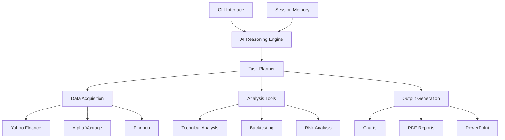

# 📈 Professional Financial Analysis Platform

[](https://python.org)
[](LICENSE)
[](https://github.com/marcoakes/ai-investment-advisor)
[](https://github.com/marcoakes/ai-investment-advisor/actions)

[](https://gitpod.io/#https://github.com/marcoakes/ai-investment-advisor)
[](https://colab.research.google.com/github/marcoakes/ai-investment-advisor/blob/main/AI_Investment_Assistant_Demo_Enhanced.ipynb)
[](https://mybinder.org/v2/gh/marcoakes/ai-investment-advisor/main)

[](https://github.com/marcoakes/ai-investment-advisor/issues)
[](https://github.com/marcoakes/ai-investment-advisor/pulls)
[](https://github.com/marcoakes/ai-investment-advisor/commits/main)

> **🚀 A comprehensive quantitative finance platform for technical analysis, backtesting, and risk management**

Professional-grade financial analysis tools combining advanced technical indicators, comprehensive backtesting engines, risk management systems, and automated report generation - built with institutional-quality standards.

---

## 📊 **Platform Overview**

### **🎯 Production CLI Interface**
```bash
$ python investment_advisor/cli.py --query "compare AAPL vs MSFT"

AI Investment Research Assistant initialized successfully!
🚀 Financial Analysis Platform
========================================

🧠 Understanding your query...
   Query type: comparative_analysis
   Symbols found: AAPL, MSFT

📋 Planned 8 task(s):
   1. stock_aggregator (data_fetch)
   2. technical_analyzer (analysis)
   3. trading_signals (analysis)
   4. chart_generator (visualization)
   [... processing both stocks ...]

⚙️ Executing analysis...
✅ Analysis completed successfully!

📈 COMPARATIVE ANALYSIS SUMMARY

🏢 AAPL: Apple Inc. (Technology)
   Current Price: $184.92
   📊 RSI: 45.2 | MACD: Bullish | SMA: Uptrend
   
🏢 MSFT: Microsoft Corporation (Technology)  
   Current Price: $378.85
   📊 RSI: 52.8 | MACD: Neutral | SMA: Sideways

📊 Professional charts generated:
   • comparative_analysis_20241209_143022.png
   • technical_indicators_AAPL_20241209_143025.png
   • technical_indicators_MSFT_20241209_143028.png
```

### **📈 Enhanced Jupyter Notebook Interface**
- **Professional backtesting engine** with walk-forward analysis
- **Comprehensive risk metrics** (CAGR, Sharpe, Sortino, Max DD, VaR)
- **Publication-ready visualizations** with signal overlays
- **Multi-asset portfolio analysis** and comparison tools

---

## ✨ **Key Features**

### 🎯 **Production-Grade Capabilities**
- **🔍 Advanced Technical Analysis** - 15+ professional indicators (RSI, MACD, Bollinger Bands, SMAs)
- **📈 Comprehensive Backtesting** - Walk-forward analysis with institutional metrics
- **📊 Multi-Source Data Integration** - Yahoo Finance, Alpha Vantage, Finnhub APIs  
- **⚖️ Risk Management Suite** - VaR, Maximum Drawdown, Sharpe/Sortino ratios
- **🎨 Professional Visualizations** - Publication-ready charts with signal overlays
- **🚀 Production CLI Interface** - Command-line tool for automated analysis
- **📓 Enhanced Jupyter Environment** - Interactive analysis with educational compliance
- **🐳 Docker Containerization** - Production deployment with Redis caching
- **🔧 CI/CD Pipeline** - Automated testing and security scanning

### 🛠️ **Supported Analysis Types**
| Analysis Type | Description | CLI Command |
|---------------|-------------|-------------|
| **Technical Analysis** | RSI, MACD, Bollinger Bands, SMAs with signals | `python investment_advisor/cli.py --query "analyze AAPL"` |
| **Comparative Analysis** | Multi-stock performance comparison | `python investment_advisor/cli.py --query "compare AAPL vs MSFT"` |
| **Strategy Backtesting** | Historical performance with metrics | Enhanced Jupyter Notebook |
| **Risk Assessment** | VaR, Sharpe, Sortino, Maximum Drawdown | Enhanced Jupyter Notebook |
| **Portfolio Analysis** | Multi-asset risk/return analysis | Enhanced Jupyter Notebook |
| **Chart Generation** | Professional technical analysis charts | Automatic with all analyses |

---

## 🚀 **Quick Start**

### **🌐 Try Online (No Installation Required)**

| Platform | Interface | Launch |
|----------|-----------|--------|
| **🔗 Gitpod** | Production CLI + Jupyter | [](https://gitpod.io/#https://github.com/marcoakes/ai-investment-advisor) |
| **📓 Google Colab** | Enhanced notebook with professional features | [](https://colab.research.google.com/github/marcoakes/ai-investment-advisor/blob/main/AI_Investment_Assistant_Demo_Enhanced.ipynb) |
| **🚀 Binder** | Interactive Jupyter environment | [](https://mybinder.org/v2/gh/marcoakes/ai-investment-advisor/main) |

### **💻 Local Installation**

#### **Option 1: Production CLI**
```bash
# Clone the repository
git clone https://github.com/marcoakes/ai-investment-advisor.git
cd ai-investment-advisor

# Install dependencies
pip install -r requirements.txt

# Copy environment template
cp .env.example .env

# Run production CLI
python investment_advisor/cli.py --query "analyze AAPL"
```

#### **Option 2: Enhanced Jupyter Notebook**
```bash
# After cloning and installing dependencies
jupyter lab

# Open: AI_Investment_Assistant_Demo_Enhanced.ipynb
# Run all cells for comprehensive analysis
```

### **🐳 Docker Production Deployment**
```bash
# Quick start with Docker Compose
git clone https://github.com/marcoakes/ai-investment-advisor.git
cd ai-investment-advisor
cp .env.example .env
docker-compose up -d

# Access Jupyter at: http://localhost:8888
```

### **Production Examples**
```bash
# Technical analysis
python investment_advisor/cli.py --query "analyze AAPL"

# Stock comparison
python investment_advisor/cli.py --query "compare TSLA vs F"

# UK stocks (London Exchange)
python investment_advisor/cli.py --query "compare BARC.L vs HSBA.L"
```

---

## 💡 **Platform Components**

### **🎯 Production CLI Interface**
```bash
# Single stock technical analysis
python investment_advisor/cli.py --query "analyze AAPL"

# Comparative analysis of multiple stocks  
python investment_advisor/cli.py --query "compare AAPL vs MSFT"

# International stocks (specify exchange)
python investment_advisor/cli.py --query "analyze BARC.L"  # London
```

### **📓 Enhanced Jupyter Notebook**
**Advanced Features Available:**
- **Professional Backtesting Engine** - Walk-forward analysis with comprehensive metrics
- **Risk Management Suite** - VaR, Sharpe ratio, Sortino ratio, Maximum Drawdown  
- **Multi-Asset Portfolio Analysis** - Risk/return comparison across different stocks
- **Publication-Ready Visualizations** - Professional charts with signal overlays
- **Educational Compliance** - Proper disclaimers and educational-only positioning

### **🐳 Production Docker Environment**
- **Redis Caching** - Faster data retrieval for repeated analyses
- **Health Monitoring** - Container health checks and automatic restarts
- **Volume Persistence** - Data and chart storage across container restarts
- **Multi-stage Builds** - Optimized production deployment

---

## 🏗️ **Architecture Overview**



### **🧩 Platform Architecture**
```
📈 Financial Analysis Platform
├── 🎯 CLI Interface (investment_advisor/cli.py)
│   └── Production-ready command-line tool
├── 📓 Enhanced Jupyter Notebook  
│   ├── AI_Investment_Assistant_Demo_Enhanced.ipynb
│   ├── Professional backtesting engine
│   ├── Risk management suite  
│   └── Publication-ready visualizations
├── 🧠 Core Framework (investment_advisor/core/)
│   ├── base.py                  # Tool registry & base classes
│   ├── session.py               # Memory & context management
│   └── reasoning.py             # Query processing & task planning
├── 📊 Data Layer (investment_advisor/data/)
│   └── stock_data.py            # Multi-source API integration
├── 🔬 Analysis Engines (investment_advisor/analysis/)
│   ├── technical.py             # 15+ technical indicators
│   └── backtesting.py           # Strategy testing framework
├── 📈 Output Generation (investment_advisor/output/)
│   ├── charts.py                # Professional chart generation
│   └── reports.py               # Automated reporting
├── 🧪 Testing (tests/)
│   └── Comprehensive test suite with 25+ test cases
├── 🐳 Production Deployment
│   ├── Dockerfile               # Multi-stage production container
│   ├── docker-compose.yml       # Full orchestration with Redis
│   └── .github/workflows/       # CI/CD pipeline
└── 🔧 Configuration
    ├── requirements.txt         # Pinned dependencies (50+)
    └── .env.example            # API key configuration template
```

---

## 📋 **Available Commands**

### **🔍 Analysis Commands**
| Command | Description | Example |
|---------|-------------|---------|
| `analyze <SYMBOL>` | Comprehensive stock analysis | `analyze AAPL` |
| `technical <SYMBOL>` | Technical analysis focus | `technical TSLA` |
| `compare <SYM1> <SYM2>` | Compare two stocks | `compare MSFT GOOGL` |
| `backtest <SYMBOL>` | Strategy backtesting | `backtest AMZN` |

### **📊 Visualization Commands**
| Command | Description | Example |
|---------|-------------|---------|
| `chart <SYMBOL>` | Generate stock charts | `chart NVDA` |
| `plot <SYMBOL>` | Price visualizations | `plot SPY` |

### **📄 Reporting Commands**  
| Command | Description | Example |
|---------|-------------|---------|
| `report` | Generate PDF report | `report` |
| `presentation` | Create PowerPoint | `presentation` |

### **⚙️ Utility Commands**
| Command | Description |
|---------|-------------|
| `status` | Session information |
| `history` | Analysis history |
| `tools` | Available tools list |
| `clear` | Clear session memory |
| `help` | Show help message |
| `quit` | Exit application |

---

## 📊 **Technical Indicators**

### **📈 Trend Indicators**
- **Simple Moving Average (SMA)** - 20, 50, 200 period
- **Exponential Moving Average (EMA)** - 12, 26 period
- **MACD** - Moving Average Convergence Divergence
- **Bollinger Bands** - Volatility bands

### **🔄 Momentum Indicators**  
- **RSI** - Relative Strength Index
- **Stochastic Oscillator** - %K and %D lines
- **Williams %R** - Momentum oscillator

### **📊 Volume Indicators**
- **Volume SMA** - Volume moving averages
- **On-Balance Volume (OBV)** - Volume-price trend
- **Volume Rate of Change** - Volume momentum

### **🎯 Trading Signals**
- **Moving Average Crossovers** - Golden/Death cross
- **RSI Overbought/Oversold** - Entry/exit signals  
- **MACD Signal Line Crossovers** - Trend changes
- **Bollinger Band Squeezes** - Volatility breakouts

---

## 📈 **Performance Metrics**

### **📊 Backtesting Metrics**
| Metric | Description |
|--------|-------------|
| **Total Return** | Overall strategy performance |
| **Annualized Return** | Yearly performance average |
| **Sharpe Ratio** | Risk-adjusted returns |
| **Maximum Drawdown** | Largest peak-to-trough decline |
| **Win Rate** | Percentage of profitable trades |
| **Volatility** | Standard deviation of returns |

### **🔍 Risk Metrics**
| Metric | Description |
|--------|-------------|
| **Value at Risk (VaR)** | Potential loss at confidence level |
| **Conditional VaR** | Expected loss beyond VaR |
| **Beta** | Market correlation coefficient |
| **Alpha** | Excess return vs benchmark |
| **Information Ratio** | Active return vs tracking error |

---

## 🔧 **Configuration**

### **🔑 API Keys (Optional)**
Enhance data access with professional APIs:

```bash
# Alpha Vantage (Free tier: 5 calls/min, 500 calls/day)
export ALPHA_VANTAGE_API_KEY="your_api_key_here"

# Finnhub (Free tier: 60 calls/min)  
export FINNHUB_API_KEY="your_api_key_here"
```

**Get API Keys:**
- [Alpha Vantage](https://www.alphavantage.co/support/#api-key) - Financial data
- [Finnhub](https://finnhub.io/register) - Market data & news

### **⚙️ Customization**
Edit `config.py` to customize:
- Output directories
- Chart styling  
- Analysis periods
- Technical indicator parameters
- Report formatting

---

## 🐳 **Docker Deployment**

### **Quick Start with Docker**
```bash
# Build and run
docker build -t ai-investment-advisor .
docker run -it ai-investment-advisor

# With Docker Compose
docker-compose up
```

### **Docker Hub**
```bash
# Pull from Docker Hub (when available)
docker pull marcoakes/ai-investment-advisor:latest
docker run -it marcoakes/ai-investment-advisor:latest
```

---

## 🌐 **Web Interface (Optional)**

Launch the web interface for browser-based access:

```bash
# Install Streamlit
pip install streamlit

# Run web app
streamlit run web_app.py
```

Access at: `http://localhost:8501`

---

## 📁 **Output Files**

The application generates:

### **📊 Charts** (`charts/`)
- `technical_chart_YYYYMMDD_HHMMSS.png` - Technical analysis charts
- `price_chart_YYYYMMDD_HHMMSS.png` - Price history charts  
- `performance_chart_YYYYMMDD_HHMMSS.png` - Backtesting results
- `comparison_chart_YYYYMMDD_HHMMSS.png` - Multi-stock comparisons

### **📄 Reports** (`reports/`)
- `investment_report_YYYYMMDD_HHMMSS.pdf` - Comprehensive analysis reports

### **📊 Presentations** (`presentations/`)
- `investment_presentation_YYYYMMDD_HHMMSS.pptx` - PowerPoint slide decks

---

## 🔧 **Requirements**

### **System Requirements**
- **Python:** 3.8 or higher
- **Memory:** 4GB RAM recommended
- **Storage:** 1GB free space
- **Network:** Internet connection for data APIs

### **Python Dependencies**
```
pandas>=2.0.0          # Data manipulation
numpy>=1.24.0          # Numerical computing  
matplotlib>=3.7.0      # Plotting
seaborn>=0.12.0        # Statistical visualization
yfinance>=0.2.20       # Yahoo Finance API
reportlab>=4.0.0       # PDF generation
python-pptx>=0.6.21    # PowerPoint generation
requests>=2.31.0       # HTTP client
scipy>=1.10.0          # Scientific computing
```

---

## 🤝 **Contributing**

We welcome contributions! Here's how to get started:

### **🐛 Bug Reports**
- Use GitHub Issues
- Include system info and error logs
- Provide steps to reproduce

### **💡 Feature Requests** 
- Describe the feature and use case
- Check existing issues first
- Consider implementation complexity

### **🔀 Pull Requests**
1. Fork the repository
2. Create feature branch: `git checkout -b feature-name`
3. Make changes with tests
4. Submit pull request

### **Development Setup**
```bash
# Clone for development
git clone https://github.com/marcoakes/ai-investment-advisor.git
cd ai-investment-advisor

# Install development dependencies
pip install -e .
pip install pytest black flake8

# Run tests
pytest

# Format code
black investment_advisor/
```

---

## 🐛 **Troubleshooting**

### **Common Issues**

#### **Import Errors**
```bash
# Reinstall dependencies
pip install -r requirements.txt --upgrade

# Check Python version
python --version  # Should be 3.8+
```

#### **API Rate Limits**  
- **Yahoo Finance:** Built-in rate limiting, retries automatically
- **Alpha Vantage:** 5 calls/min free tier - upgrade for more
- **Finnhub:** 60 calls/min free tier

#### **Memory Issues**
```bash
# Clear session memory
clear

# Restart application
quit
python investment_advisor/cli.py
```

#### **Chart Generation Errors**
```bash
# Install system dependencies (Linux)
sudo apt-get install python3-dev python3-tk

# macOS  
brew install python-tk

# Windows: Usually included with Python
```

#### **PDF Generation Issues**
```bash
# Install additional fonts (Linux)
sudo apt-get install fonts-liberation

# Check permissions
ls -la reports/
```

### **Getting Help**
- 📖 Check documentation first
- 🐛 Search existing GitHub Issues  
- ❓ Ask questions in Discussions
- 📧 Contact maintainers for critical issues

---

## 📜 **License**

This project is licensed under the **MIT License** - see the [LICENSE](LICENSE) file for details.

### **Educational Disclaimer**
⚠️ **Important:** This platform is designed for **educational and research purposes only**. It provides technical analysis tools and backtesting capabilities but does **NOT** provide investment advice or trading recommendations. 

**Key Points:**
- All analysis outputs are for **educational demonstration** of quantitative finance techniques
- **Past performance does not guarantee future results**
- Always **conduct your own due diligence** and consult qualified financial professionals
- This platform is a **technical analysis tool**, not an investment advisor
- No AI-powered predictions or recommendations are provided

Built with institutional-quality standards for **educational** use in quantitative finance and technical analysis.

---

## 🌟 **Star History**

[](https://star-history.com/#marcoakes/ai-investment-advisor&Timeline)

---

## 📞 **Support & Community**

- 🐛 **Issues:** [GitHub Issues](https://github.com/marcoakes/ai-investment-advisor/issues)
- 💬 **Discussions:** [GitHub Discussions](https://github.com/marcoakes/ai-investment-advisor/discussions)  
- 📧 **Email:** your.email@example.com
- 🐦 **Twitter:** [@marcoakes](https://twitter.com/marcoakes)

---

## 🙏 **Acknowledgments**

Special thanks to:
- **Yahoo Finance** for free financial data API
- **Matplotlib/Seaborn** for visualization capabilities
- **ReportLab** for PDF generation
- **Python-pptx** for PowerPoint automation
- **Open source community** for foundational libraries

---

<div align="center">

**⭐ If you find this project helpful, please give it a star! ⭐**

[⬆ Back to Top](#-ai-investment-research-assistant)

</div>